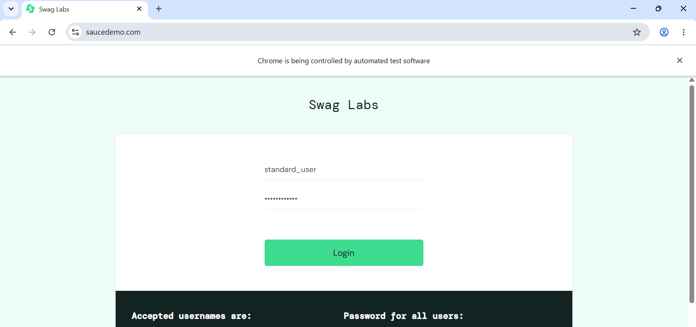

# Assignment 1: The Multi-Locator Challenge

## Objective

To automate the login process of the SauceDemo website using different Selenium locators and verify that the user is successfully redirected to the inventory page.

## Tools, Software, and Concepts Used

- Python
- Selenium WebDriver
- Google Chrome
- Chrome WebDriver
- `By.ID`
- `By.NAME`
- `By.XPATH`
- `time.sleep()`
- Assertions

## Task

1. Open the SauceDemo website.
2. Locate the username field using `By.ID`.
3. Locate the password field using `By.NAME`.
4. Locate the login button using `By.XPATH`.
5. Enter the login credentials.
6. Click the Login button.
7. Verify that the resulting URL contains `/inventory.html`.

## Source Code

The complete source code is available in:

[assignment1.py](assignment1.py)

## Result

The program successfully launched Google Chrome, opened the SauceDemo website, entered the username and password using different Selenium locators, clicked the Login button, and successfully navigated to the inventory page.

The resulting URL contained `/inventory.html`, confirming that the login was successful.

## Screenshot

The following screenshot shows the successful execution of the Selenium automation:

## Observation

- Google Chrome was launched successfully using Selenium WebDriver.
- The SauceDemo login page was opened successfully.
- The username field was located using `By.ID`.
- The password field was located using `By.NAME`.
- The Login button was located using `By.XPATH`.
- The username and password were entered successfully.
- The Login button was clicked successfully.
- The inventory page was opened after successful login.
- The URL was verified using an assertion.
- The browser was closed successfully using `driver.quit()`.

## Conclusion

The experiment demonstrated the use of Selenium WebDriver with Python for automating a login process using multiple locator strategies. It also demonstrated how to validate the result of an automated action using URL verification and an assertion.
