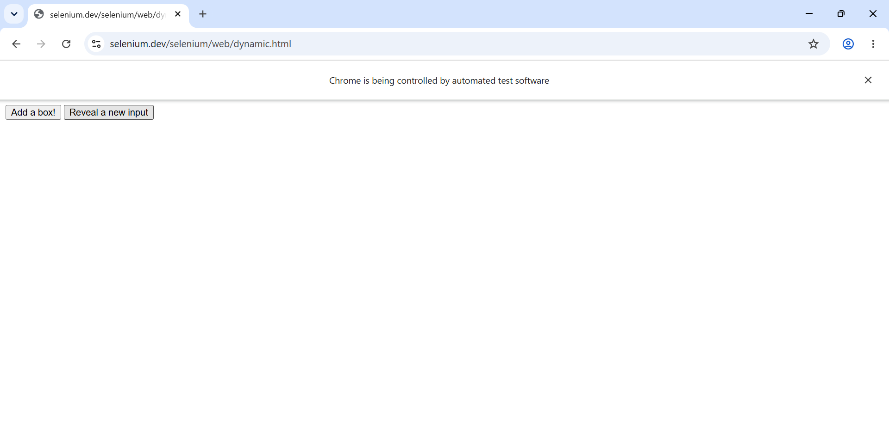
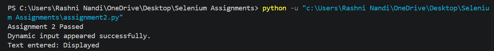

# Assignment 2: Synchronization & Explicit Waits

## Objective

To demonstrate synchronization in Selenium WebDriver using explicit waits and expected conditions while interacting with dynamically displayed web elements.

## Tools, Software, and Concepts Used

- Python
- Selenium WebDriver
- Google Chrome
- Chrome WebDriver
- `WebDriverWait`
- `expected_conditions`
- `EC.element_to_be_clickable()`
- `EC.visibility_of_element_located()`
- Assertions
- Dynamic web elements

## Task

1. Open the Selenium dynamic web page.
2. Locate the "Reveal a new input" button.
3. Wait until the button becomes clickable.
4. Click the button.
5. Wait until the hidden input field becomes visible.
6. Enter text into the dynamically revealed input field.
7. Verify that the text was entered successfully.
8. Close the browser.
9. Do not use `time.sleep()`.

## Source Code

The complete source code is available in:

[assignment2.py](assignment2.py)

## Result

The program successfully launched Google Chrome, opened the Selenium dynamic web page, waited for the "Reveal a new input" button to become clickable, and clicked the button.

The hidden input field was dynamically revealed, and Selenium successfully waited for the input field to become visible before entering the text "Displayed".

The entered text was verified successfully using an assertion.

## Screenshot

The following screenshot shows the successful execution of the Selenium automation:

## Observation

- Chrome was launched successfully using Selenium WebDriver.
- The Selenium dynamic web page was opened successfully.
- `WebDriverWait` was used for synchronization.
- `EC.element_to_be_clickable()` was used to wait for the button.
- The "Reveal a new input" button was clicked successfully.
- `EC.visibility_of_element_located()` was used to wait for the hidden input field.
- The input field became visible dynamically.
- The text "Displayed" was entered successfully.
- The entered text was verified using an assertion.
- `time.sleep()` was not used.
- The browser was closed successfully using `driver.quit()`.

## Conclusion

The experiment demonstrated the use of Selenium WebDriver with Python for handling dynamically displayed web elements using explicit waits. It showed how `WebDriverWait` and expected conditions can be used to synchronize automation with the actual state of a webpage instead of using fixed delays such as `time.sleep()`.
