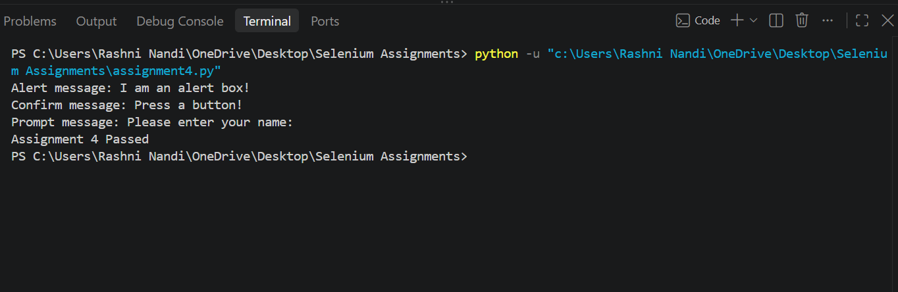

# Assignment 4: JavaScript Alerts and Confirms

## Objective

To automate and handle JavaScript Alert, Confirm, and Prompt boxes using Selenium WebDriver with Python.

## Tools, Software, and Concepts Used

- Python
- Selenium WebDriver
- Google Chrome
- Chrome WebDriver
- JavaScript Alert
- JavaScript Confirm Box
- JavaScript Prompt Box
- `driver.switch_to.alert`
- `alert.accept()`
- `alert.dismiss()`
- `alert.send_keys()`

## Task

1. Open the Test Automation Practice website.
2. Trigger a JavaScript Alert.
3. Accept the Alert box.
4. Trigger a JavaScript Confirm box.
5. Dismiss the Confirm box.
6. Trigger a JavaScript Prompt box.
7. Enter text into the Prompt using `send_keys()`.
8. Accept the Prompt box.
9. Close the browser successfully.

## Source Code

The complete source code is available in:

[assignment4.py](assignment4.py)

## Result

The program successfully launched Google Chrome and opened the Test Automation Practice website.

The JavaScript Alert was triggered and accepted successfully. The Confirm box was triggered and dismissed successfully. The Prompt box was triggered, text was entered using Selenium, and the Prompt was accepted successfully.

The successful execution of all three JavaScript dialog interactions was verified through the console output.

## Screenshot

The following screenshot shows the console output from the successful execution of the Selenium automation:

## Observation

- Chrome was launched successfully using Selenium WebDriver.
- The Test Automation Practice website was opened successfully.
- The JavaScript Alert was triggered and accepted using `alert.accept()`.
- The JavaScript Confirm box was triggered and dismissed using `confirm.dismiss()`.
- The JavaScript Prompt box was triggered successfully.
- Text was entered into the Prompt using `prompt.send_keys()`.
- The Prompt was accepted using `prompt.accept()`.
- The console displayed the messages from the Alert, Confirm, and Prompt boxes.
- The browser was closed successfully using `driver.quit()`.

## Conclusion

The experiment demonstrated how Selenium WebDriver can be used to handle different types of JavaScript dialogs. The Alert was accepted, the Confirm box was dismissed, and text was entered and submitted in the Prompt box using Selenium's alert-handling methods.
