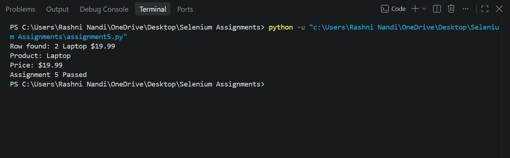

# Assignment 5: HTML Web Table Extractor

## Objective

To automate the extraction of data from an HTML web table using Selenium WebDriver with Python and retrieve a specific value by searching for a particular name in the table.

## Tools, Software, and Concepts Used

- Python
- Selenium WebDriver
- Google Chrome
- Chrome WebDriver
- HTML Web Tables
- `find_elements()`
- XPath
- `By.TAG_NAME`
- Nested loops
- Row and column traversal
- Assertions

## Task

1. Open the Test Automation Practice website.
2. Locate the HTML web table.
3. Retrieve all rows from the table.
4. Iterate through each row.
5. Retrieve all columns from the current row.
6. Search for a specific product name in the table.
7. Locate the corresponding row.
8. Retrieve the Price value from the same row.
9. Display the product name and price in the console.
10. Verify that the product was found successfully.
11. Close the browser.

## Source Code

The complete source code is available in:

[assignment5.py](assignment5.py)

## Result

The program successfully launched Google Chrome and opened the Test Automation Practice website.

The HTML web table was located using Selenium WebDriver. The program iterated through the rows and columns of the table and searched for the specified product name.

After finding the product, the corresponding Price value was retrieved and displayed in the console.

The successful execution was verified using an assertion.

## Screenshot

The following screenshot shows the console output from the successful execution of the Selenium automation:

## Observation

- Chrome was launched successfully using Selenium WebDriver.
- The Test Automation Practice website was opened successfully.
- The HTML web table was located using XPath.
- All table rows were retrieved using `find_elements()`.
- Each row was processed individually.
- The columns of each row were retrieved using `By.TAG_NAME`.
- A nested loop was used to search through the table columns.
- The specified product name was successfully located.
- The corresponding Price value was retrieved from the same row.
- The result was displayed in the console.
- An assertion was used to verify that the product was found.
- The browser was closed successfully using `driver.quit()`.

## Conclusion

The experiment demonstrated how Selenium WebDriver with Python can be used to interact with HTML web tables. It showed how to iterate through rows and columns, search for a specific value, and retrieve related information from the same table row.
