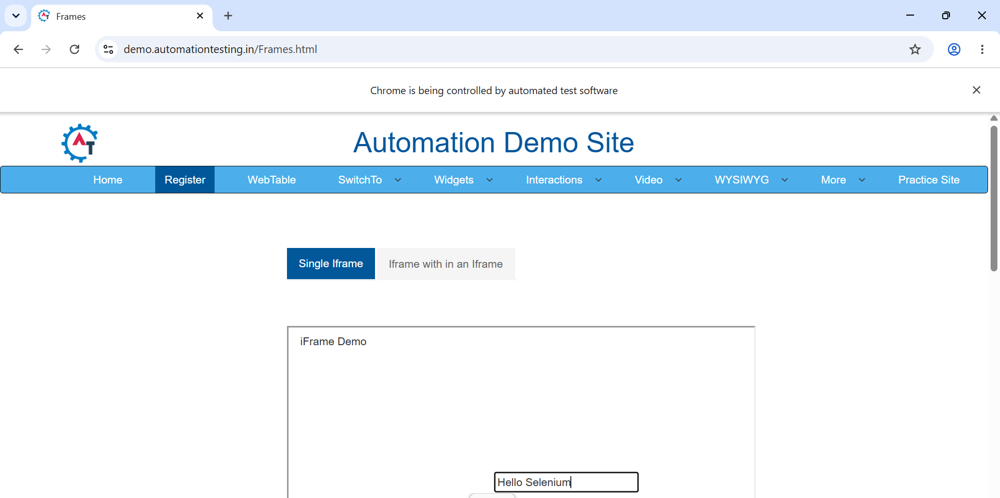
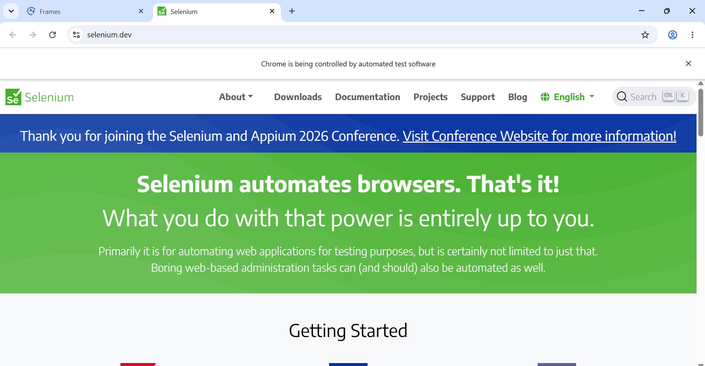

# Assignment 6: Windows, Tabs, and Iframes

## Objective

To automate interactions with an iframe and multiple browser tabs using Selenium WebDriver with Python.

## Tools, Software, and Concepts Used

- Python
- Selenium WebDriver
- Google Chrome
- Chrome WebDriver
- Iframes
- Browser Windows and Tabs
- `driver.switch_to.frame()`
- `driver.switch_to.default_content()`
- `driver.current_window_handle`
- `driver.window_handles`
- `driver.switch_to.window()`
- `driver.execute_script()`
- `driver.title`
- `driver.close()`

## Task

1. Open a webpage containing an embedded iframe.
2. Switch Selenium's control to the iframe.
3. Locate and interact with an element inside the iframe.
4. Switch back to the main page.
5. Open a new browser tab.
6. Retrieve all available browser window handles.
7. Switch to the newly opened tab.
8. Retrieve and display the title of the new tab.
9. Close the new tab.
10. Switch back to the original browser window.
11. Close the browser successfully.

## Source Code

The complete source code is available in:

[assignment6.py](assignment6.py)

## Result

The program successfully launched Google Chrome and opened the Frames webpage.

Selenium successfully switched to the embedded iframe and entered the text "Hello Selenium" into the input field.

After completing the iframe interaction, Selenium switched back to the main page using `driver.switch_to.default_content()`.

A new browser tab was then opened using JavaScript. Selenium retrieved the available window handles and successfully identified and switched to the new tab.

The title of the new tab was retrieved and displayed in the console. The new tab was then closed, and Selenium successfully switched back to the original browser window.

The successful execution was verified through the console output.

## Screenshot

The following screenshot shows the console output from the successful execution of the Selenium automation:

## Observation

- Chrome was launched successfully using Selenium WebDriver.
- The Frames webpage was opened successfully.
- The iframe was located using XPath.
- Selenium switched to the iframe using `driver.switch_to.frame()`.
- The input field inside the iframe was located successfully.
- The text "Hello Selenium" was entered into the iframe.
- Selenium switched back to the main page using `driver.switch_to.default_content()`.
- The main browser window handle was stored using `driver.current_window_handle`.
- A new browser tab was opened using `driver.execute_script()`.
- The available browser window handles were retrieved using `driver.window_handles`.
- Selenium switched to the new tab using `driver.switch_to.window()`.
- The title of the new tab was retrieved using `driver.title`.
- The new tab was closed using `driver.close()`.
- Selenium switched back to the original browser window.
- The browser was closed successfully using `driver.quit()`.

## Conclusion

The experiment demonstrated how Selenium WebDriver can handle different browser browsing contexts. It showed how to switch between the main page and an iframe, open and manage a new browser tab using window handles, retrieve the title of the new tab, close the tab, and return to the original browser window.
