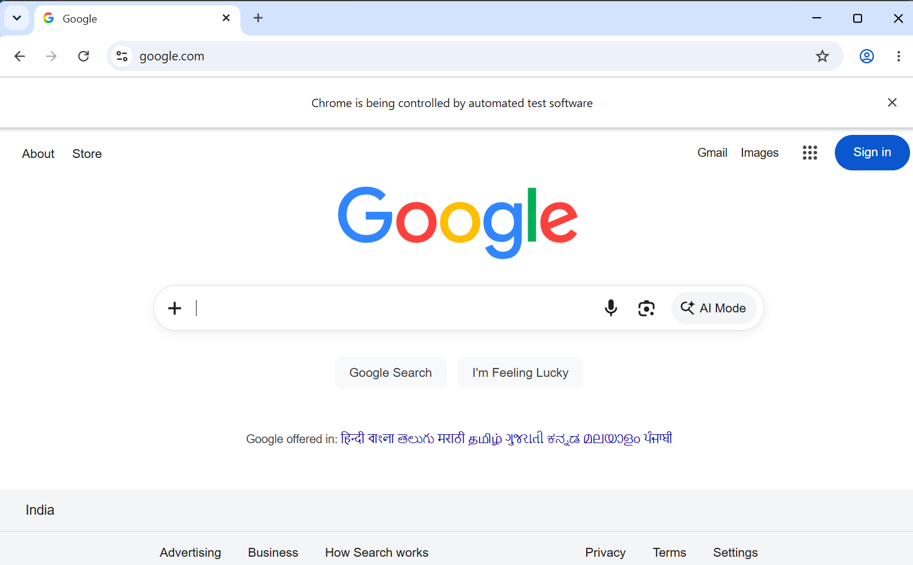
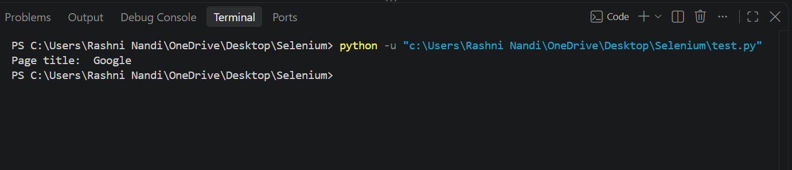

# Module 1.2 - Selenium WebDriver Introduction and Installation
## Experiment Title - Selenium WebDriver: Launching Google and Printing Page Title

## Problem Statement 
To develop a Python Selenium WebDriver program that launches Google Chrome, opens the Google website, retrieves the webpage title and displays it in the console. 

## Objective

- To understand the basic working of Selenium WebDriver.
- To launch Google Chrome using Selenium.
- To navigate to a webpage using `driver.get()`.
- To retrieve the webpage title using `driver.title`.
- To close the browser safely using `driver.quit()`.

## Tools, Software, and Concepts Used

### Tools and Software

- Python
- Selenium WebDriver
- Google Chrome
- VS Code

### Concepts Used

- Web browser automation
- Selenium WebDriver
- `webdriver.Chrome()`
- `driver.get()`
- `driver.title`
- `driver.quit()`
- `try-finally` block

## Source Code

For the complete source code, refer to [`test.py`](test.py).

## Output

### Screenshot 1 – Google Website Opened

### Screenshot 2 – Console Output

## Result

The program successfully launched Google Chrome, opened the Google website, and displayed its page title in the console.

## Observation

- Chrome was launched successfully using Selenium WebDriver.
- The Google webpage was opened successfully.
- The webpage title was retrieved using `driver.title`.
- The browser was closed successfully using `driver.quit()`.

## Conclusion

The experiment demonstrated the basic use of Selenium WebDriver with Python for browser automation, including opening a webpage, retrieving its title, and closing the browser safely.
